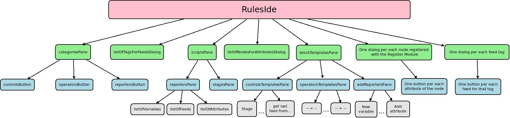

#Rules programmer
The **rules programmer** is a visual tool used in the view [rules_edit_rule.php](Views/rules_edit_rule.php) to define the actions of a rule. It is not straight to understand how it works so the aim of this documentation is to give an overview of its structure with the aim to help future developments. How to extend its functionality is explained in the document [readme_how_to_extend_rules_functionality.md](readme_how_to_extend_rules_functionality.md).
##Morphic.js
The rules programmer is based on the marvellous library [Morphic.js](https://github.com/jmoenig/morphic.js) and also uses code from [Snap!](https://snap.berkeley.edu/) and amazing visual, drag-and-drop programming language. Both developed by [Jens Mönig](https://github.com/jmoeni). The rules programmer would have never been possible to implement without them.

In order to introduce what Morphic.js is, I want to quote its [documentation](https://github.com/jmoenig/morphic.js/blob/master/morphic.txt):
>**Morphic.js** provides a library for lively GUIs inside single HTML Canvas elements. Each such canvas element functions as a "world" in which other **visible shapes ("morphs")** can be positioned and manipulated, often directly and interactively by the user. **Morphs are tree nodes and may contain any number of submorphs ("children")**.

>**All things visible in a morphic World are morphs themselves**, i.e. all text rendering, blinking cursors, entry fields, menus, buttons, sliders, windows and dialog boxes etc. are created with morphic.js rather than using HTML DOM elements, and as a consequence can be changed and adjusted by the programmer regardless of proprietary browser behavior.

#rulesIDE and emonCMS_RulesIDE_Morph
The rules programmer is a JavaScript object:  **rulesIDE**. It can be found in [rules_edit_rule.php](Views/rules_edit_rule.php). It is an instance of the class **emonCMS_RulesIDE_Morph** which is defined in [emonCMS_RulesIDE_gui.js](scripts/emonCMS_RulesIDE_gui.js).

The rulesIDE is a Morph object when the **init** method is called we add to it every element (morph) you can find in the rules programmer. See the diagram below that shows the morph hierarchy:

The following morphs are always visible:

 - **categoriesPane** and submorphs: on the top left of the programmer. Clicking on a category will display in the *blockTemplatesPane* the buttons available for that category
 - **blockTemplatesPane**: below categoriesPane
 - **scriptsPane** and submorphs:
	 - **stagesPane**: in the middle of the programmer. Holds the blocks.
	 - **reportersPane** and submorphs: on the right side of the programmer. Holds the available variables (also called reporters)

The following morphs are only displayed when clicking on another morph:

 - **listOfTagsForFeedsDialog**: displayed when we click on *Add feed*
 - **listOfNodesForAttributesDialog**: displayed when we click on *Add attribute*
 - **Dialog showing all the feeds for a tag**: displayed when click on a tag on the *listOfTagsForFeedsDialog*
 - **Dialog showing all the attributes for a node**: displayed when click on a node on the *listOfNodesForAttributesDialog*
 - **controlsTemplatesPane**, **operatorsTemplatesPane** and **addReportersPane**: displayed when we click on one of the buttons in *categoriesPane*

